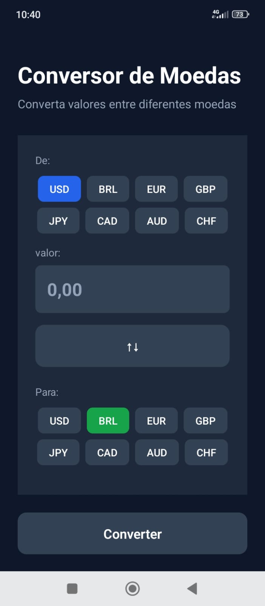
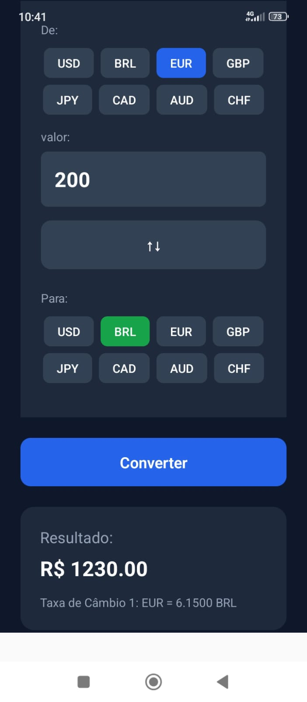

📱 Conversor de Moedas

Aplicativo de conversão de moedas desenvolvido em React Native + Expo, integrando uma API de câmbio para obter valores atualizados em tempo real.
O projeto foi criado com foco em boas práticas, modularização e consumo de dados externos, permitindo conversões rápidas e precisas entre diversas moedas.

🚀 Funcionalidades

🔄 Conversão instantânea entre moedas

🌎 Suporte a múltiplas moedas internacionais

📡 Consumo de API externa com taxas atualizadas

🧮 Cálculo automático baseado no valor informado

🖥 Interface simples e intuitiva

⚙️ Código estruturado e modular

🛠 Tecnologias Utilizadas

React Native

Expo

JavaScript

Fetch API

API de Taxas de Câmbio (ExchangeRate API)

📦 Instalação e Uso
1️⃣ Clone o repositório
git clone https://github.com/SEU_USUARIO/SEU_REPOSITORIO.git

2️⃣ Acesse o diretório do projeto
cd SEU_REPOSITORIO

3️⃣ Instale as dependências
npm install

4️⃣ Execute o projeto com Expo
npx expo start -c

Abra o app no seu dispositivo usando o Expo Go ou no emulador Android/iOS.

📡 Consumo da API

A conversão utiliza dados fornecidos pela ExchangeRate API:

const BASE_URL = "https://api.exchangerate-api.com/v4/latest";

export async function exchangeRateApi(fromCurrency) {
  try {
    const response = await fetch(`${BASE_URL}/${fromCurrency}`);
    const data = await response.json();
    return data;
  } catch (error) {
    console.log(error);
  }
}

📸 Imagem App

  
  
  

🧱 Estrutura do Projeto (exemplo)
/src
  /components
   -> Button
      index.js
      style.js
      
   -> input
    |-index.js
    |-style.js
      
   -> ResultCard
    |-index.js
    |-style.js
  /constants
    |-currencies.js
  /services
    |-api.js
  /styles
    |-colors
  /utils
    |-convertCurrency
  App.js
assets/
app.json
package.json

🤝 Contribuições

Contribuições são sempre bem-vindas!
Abra um issue ou envie um pull request.

📝 Licença

Este projeto está sob a licença MIT.
Sinta-se livre para usar, modificar e distribuir.

⭐ Mostre seu apoio

Se gostou do projeto, deixe uma ⭐ no repositório!
